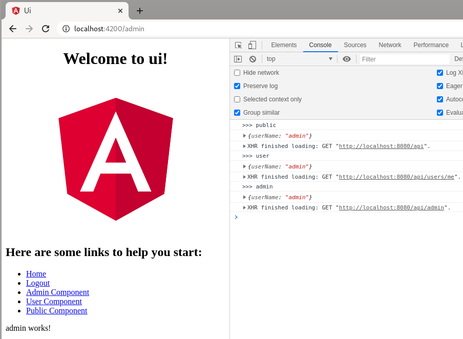

# quarkus angular keycloak

Keycloak Quarkus Angular demo showing:

- UI uses `OpenID Connect` and `OAuth2` using `public` access type (no secret in ui code required). This involves `Authorization code grant with PKCE` - https://devansvd.com/oauth/#authorization-code-grant-with-pkce
- `angular-oauth2-oidc` - Angular, OIDC UAuth2 - https://github.com/manfredsteyer/angular-oauth2-oidc
- `Code` flow and `PKCE` to align with the current draft of the OAuth 2.0 Security Best Current Practice document - https://tools.ietf.org/html/rfc6749
- `Pixy` - RFC 7636 - Authorization Code Grant with PKCE (Proof Key for Code Exchange by OAuth Public Clients) - https://tools.ietf.org/html/rfc7636
- Server uses `OAuth2` using `confidential` access type (client secret required) with `quarkus-keycloak-authorization extension` - https://quarkus.io/guides/security-keycloak-authorization

Angular client uses [`APP_INITIALIZER`](ui/src/app/auth.config.module.ts) to initiate auth module and components and login to the `quarkus` realm in keycloak prior to loading.

The `Auth Guard` and `Auth Interceptor` components map `roles` to component uri's see the [`app-routing-module.ts`](ui/src/app/app-routing.module.ts) for usage.

In Quarkus, Keycloak is responsible for managing the roles and deciding who can access which routes. See the Keycloak `backend-serivce` client `Authorizations` tab for policy and permission details. The server side extension fetches resources on-demand from Keycloak where their URI are used to map the resources in your application that should be protected.

There is no SSL configured (this is on purpose to keep auth code clear, obviously don't do this in production!)



## Running the demo locally

Start Keycloak
```bash
podman-compose up -d
```

Browse to Admin Console and login as admin/admin
```
http://localhost:8180
```

Select `Master -> Add Realm -> Select File` to create quarkus realm
```bash
quarkus-realm.json
```

Start API Server
```bash
cd service
mvn quarkus:dev
```

Start Angular UI
```bash
cd ui
npm i
npm run start
```

User/Login and Roles in quarkus realm
```bash
admin / admin - roles [admin, user]
alice / alice - roles [user]
```

Use the UI broswer links and the browser console (F12 developer tools in chrome) for debug.

The User Interface has 3 angular components, each calls a service API XMLHttpRequest endpoint, which is displayed in console.log
```bash
admin - localhost:8080/api/admin
user - localhost:8080/api/users/me
public - localhost:8080/api
```

- `alice` will be able to see the `User and Public Component` endpoints but not be able to browse to the `Admin Component` endpoint. 
- `admin` user can browse to the all component endpoints.
- anonymous acess is available to the public api endpoint.

Unauthenticated access to admin, user endpoints will result in:
```bash
http localhost:8080/api/admin
HTTP/1.1 401 Unauthorized
content-length: 0
```

The public endpoint is always available e.g. from cli:
```bash
http localhost:8080/api
HTTP/1.1 200 OK
Content-Length: 15
Content-Type: application/json

{
    "userName": ""
}
```

CLI example request using `curl` or `http` client:
```bash
# Login
export access_token=$(\
curl -s -X POST http://localhost:8180/auth/realms/quarkus/protocol/openid-connect/token \
   --user backend-service:secret \
   -H 'content-type: application/x-www-form-urlencoded' \
   -d 'username=admin&password=admin&grant_type=password' | jq --raw-output '.access_token'
)

# curl
curl -v -X GET \
  http://localhost:8080/api/admin \
  -H "Authorization: Bearer "$access_token

# or use http
http localhost:8080/api/admin "Authorization: Bearer $access_token"

# Authenticated Result
HTTP/1.1 200 OK
Content-Length: 20
Content-Type: application/json

{
    "userName": "admin"
}
```

## Notes

If you wanted to completely turn off authentication in the quarkus api server, set these in [`application.properties`](service/src/main/resources/application.properties):
```bash
quarkus.keycloak.policy-enforcer.enable=false
quarkus.keycloak.policy-enforcer.paths.api.path=/api/*
quarkus.keycloak.policy-enforcer.paths.api.enforcement-mode=DISABLED
```

Currently the Angular UI flow initializes by directing to Keycloak first before loading anything (common for Single Page Web Apps), the public api is still accessible anonymously.
